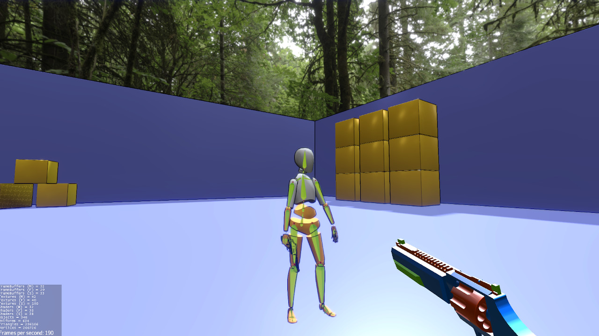
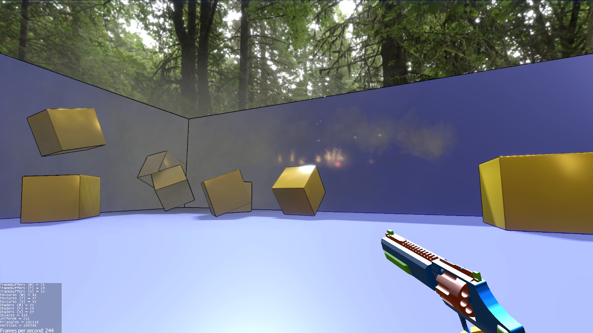
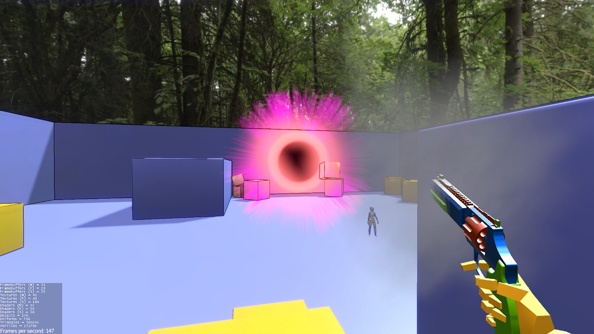

jMonkeyEngine :: FPS Demo
===
An FPS demo made with jMonkeyEngine.

The demo contains:
- Physics (with bullet engine)
- Animations (with f3b animations)
- Particles (with bullet effekseer)
- First person view always drawn on top (no gun clipping with the world)
- Spatialized audio (with jmePhonon)
- Collision effects (sounds and smoke)
- Postprocessing


Resources used:

- Code
    - [jMonkeyEngine](https://jmonkeyengine.org/)
    - [F3b + F3b Animations](https://github.com/riccardobl/f3b)
    - [jme-effekseer-Native](https://github.com/riccardobl/jme-effekseerNative)
    - [ShaderBlowEx](https://jmonkeystore.com/471f0c67-7911-48c4-84e8-d1f523555400)
    - [Jesse](https://jmonkeystore.com/de9aa155-7285-4a13-aedf-f6ea364aab3b)
    - [jmePhonon](https://github.com/jmePhonon/jmePhonon)

- Assets
    - [RedEclipse Sounds](https://opengameart.org/content/red-eclipse-sounds)
    - [Scifi Concentration](https://opengameart.org/content/scifi-concentration)
    - [Magnum for Blender 2.8](https://www.blendswap.com/blend/23122)
    - [Whipple Creek Regional Park 04](https://hdrihaven.com/hdri/?h=whipple_creek_regional_park_04)




------



------



------


## Get the demo

You can get a precompiled jar from the release page or compile from source with:

```console
gradle build
```

The compiled output in build/libs/fps-demo-XXXX.jar

Run with 

```console
java -jar fps-demo-*.jar
```

## License
Everything is released under [CC0](https://creativecommons.org/share-your-work/public-domain/cc0/) unless otherwise specified